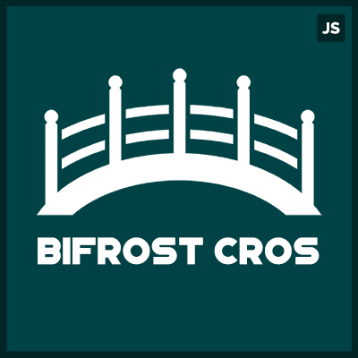

<p align="center">

</p>

# Bifrost-CORS
###### A cross-domain communication solution to share data and many more  functionalities with simple as just calling a method.

#### Get Started
 ##### NPM Install
> __npm install bifrost-cors__
##### CDN Link (6.39KB)
>__https://cdn.jsdelivr.net/gh/spurushottam13/bifrost-cors/index.min.js__

##### GZIP version of File (1.7KB)
>https://cdn.jsdelivr.net/gh/spurushottam13/bifrost-cors/index.min.gz

#### Functionalities can be performed on CROS Domain
 -------------
 
- ###### [Get, Set Cookie](#cookies)
- ###### [Get, Set & Delete  Local Stroage](#localStorage) 
- ###### [Bi-directional message thread](#bi-directional-message-thread-1)
- ###### [Run JS expression from one domain to other](#run-jS-expression)
- ###### [DOM Manipulation from one domain to other domain ( Iframe )](#dOM-manipulation)

All above methods are wrapped in a promise. 


----
##### Initialize Bifrost-CORS  *You have to Initialize Bifrost-CORS in both domain*
```javascript
var bifrostCors = new bifrostCors(address, iframeBoolean,iframeId)	
```
| Parameter        | Required           | Value  |
| :------------- |:---------------------|:-----|
| address      | YES | Exact Address of the other domain|
| iframeBoolean| No     |  <b>true</b> :- If you already rendering the other domain in iframe <br> <b>false</b> If you are not rendering the other domain in iframe <br> Default <b>false</b> |
| iframeId| No     |  if __iframeBoolean__ is set to __true__ then you need to pass the ID for your Iframe in which you loading the other domain |

---
##### Implementation of methods and how to handle promise
```javascript
var bifrostCors = new bifrostCors("http://example.com/",false)

//Calling Methods without promise
var result = bifrostCors.getLocalStorage(key)

//Hanlde Promise

//1. Using .then()
bifrostCors.getLocalStorage(key).then((data) => {
	console.log(data)
 })

//2. Using async function
async function grabLocalStorage(){
	let result = await  bifrostCors.getLocalStorage(key)
}
```
---
#### Functionalities
* __Cookies__
	* __Get Cookies__
	```javascript
    // return type Object, return all cookies
    bifrostCors.getCookie() 
    
   // return type string
   bifrostCors.getCookie("key")
    ```
    
    * __Set Cookies__
	```javascript
    bifrostCors.setCookie(name,value,days)   
     ```
     * Parameter 
     	* name __String__,  name for cookie
        * value __String__, value for cookie
        * days __int__, expiration days for cookie
        
     * return type __Boolean__
     
* __LocalStorage__	
	* __Get local Storage__
	```javascript
    // return type stirng
    bifrostCors.getgetLocalStorage("key") 
    
    // return type array
    bifrostCors.getLocalStorage(["key1","key2"])
    ```
    
    * __Set local Storage__
	```javascript
    // return type Boolean
    bifrostCors.setLocalStorage({key: "user", value: "user-1"}) 
    ```
    
    * __Delete local Storage__
	```javascript
    // return type Boolean
    bifrostCors.deleteLocalStorage("key") 
    
    // return type Boolean
    bifrostCors.deleteLocalStorage(["key1","key2"])
    ```

* __Bi-directional message thread__
	* __Request Message Thread__
	```javascript
    // return type Boolean, parameter type funtion
    bifrostCors.requestMessageThread(Listner)
    ```
   Listner is your custom function which will be invoked every time new message recivied, and it should expect a new message as a parameter
    
   Here's exapmle
   
   ```javascript
   function myCustomListner(newMessage){
   	cosnole.log("Hurray I got new message ",newMessage)
    }
    
    bifrostCors.requestMessageThread(myCustomListner)
   ```
   
    * __Send Message__
	```javascript
    // return type Boolean, parameter type string|int|array|object
    bifrostCors.send(message)
     ```
     
* __Run JS expression__
	```javascript
    // return type Boolean, parameter type string
    bifrostCors.runExpression(expression)
     ```
* __DOM Manipulation__
	* __DOM Manipulation by ID__
	```javascript
    // return type Boolean, parameter type string
    bifrostCors.domManipulationById("yourElementID")
     ```
    * __DOM Manipulation by class name__
	```javascript
    // return type Boolean, parameter type string,int,Objet
    bifrostCors.domManipulationById(class,index,style)
     ```
  	* Parameter 
     	* class __String__  your element class name
        * index __int__ index no of that element in class array
        * style __Object__ Style object
        
    * Example:a
    if you can access element by 
    ```document.getElementsByClassName("myElementClass)[4]```<br/>
    so parameter will be <br/>
    	* class "myElementClass"
    	* index 4
    	* style {background:"red"}
